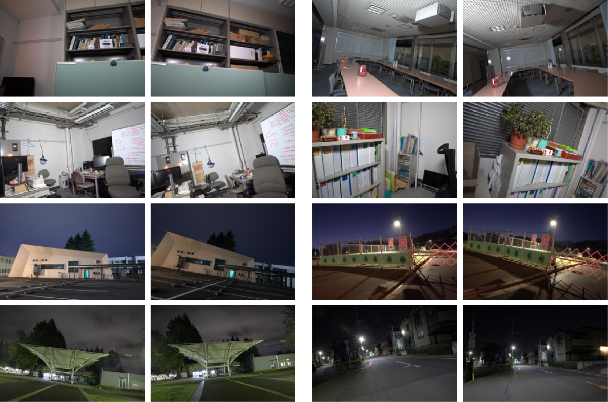

<!--<h3><b>Matching in the Dark</b></h3>-->
## <b>MID dataset</b> [[Homepage]](https://wenzhengchina.github.io/projects/mid/) <br>
[Wenzheng song](https://Wenzhengchina.github.io/), [Masanori Suganuma](), [Xing Liu](), [Noriyuki Shimobayashi](), [Daisuke Maruta](), [Takayuki Okatani]().

**+ Matching in the Dark: A Dataset for Matching Image Pairs of Low-light Scenes**

**[Introduction]** This repository contains details about the `MID` (Matching in the Dark) dataset. The `MID` dataset was introduced as a benchmark for local descriptor
evaluation challenge in extreme low-light conditions. This dataset also can be used for low-light Raw image-enhancing evaluation. See the [paper]() for more details.

* The dataset contains diverse scenes consisting of 54 outdoor and 54 indoor scenes.

* For each scene, we provide one pair of groups of multiple RAW-format images captured from different two positions.

* In each group, there are 48 (6 shutter speeds × 8 ISO settings) underexposure images and one correspond long-exposure image.

* We provide ground truth relative camera pose for each scene obtained with long-exposure images.

**[Samples]** Here are example stereo image pairs (long exposure versions) of four indoor scenes and four outdoor scenes!



If there is a need to manually get the `MID dataset`, download
and untar the following file:

* [MID](https://drive.google.com/drive/folders/1_K-gnCcbyVIa8zzTVC8EGsCZRi8V2hGQ?usp=sharing) [460GB].
### Citation ###

If you find these models useful for your resesarch, please cite with this bibtex.

```

```

